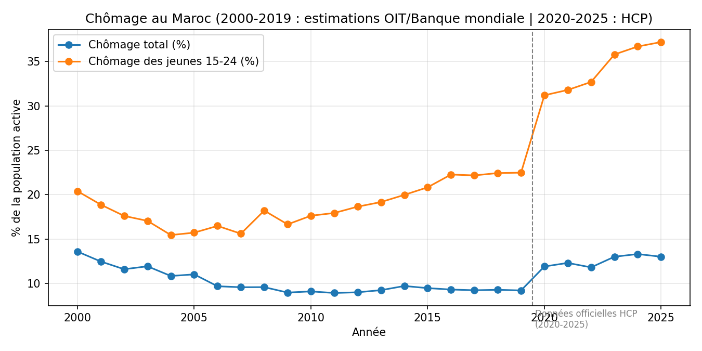
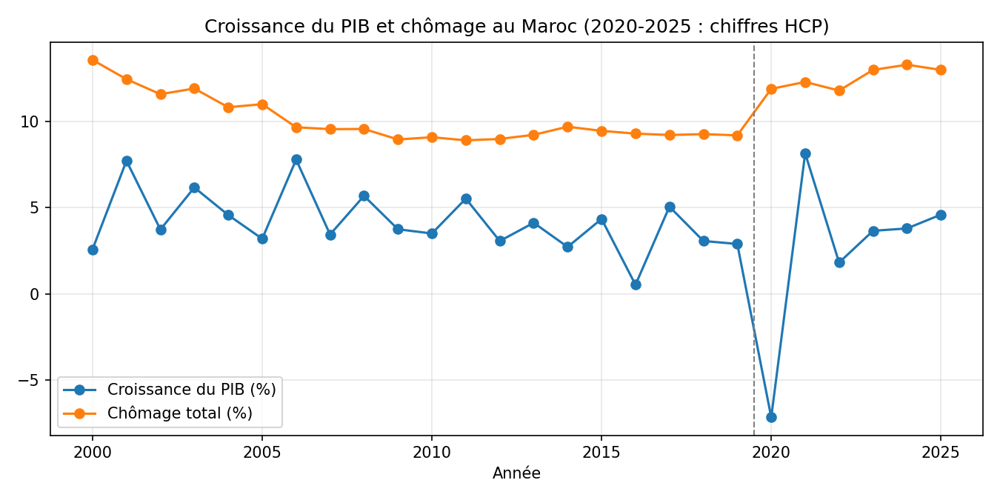

# Pourquoi le taux de chômage augmente-t-il « sans cesse » au Maroc ?

**Auteure :** Oumaima Zaaiter, ENCG Settat
**Cours :** Base de données & Data Science
**Période étudiée :** 2000 – 2025

---

## 1. Introduction

La question posée suppose que le chômage augmente sans cesse au Maroc. Avant d'expliquer un phénomène, il faut vérifier qu'il existe. Ce rapport teste donc cette affirmation avec des données chiffrées, puis cherche les raisons pour lesquelles le chômage reste un problème majeur malgré tout.

**Problématique :** le chômage augmente-t-il réellement au Maroc, et pourquoi reste-t-il si élevé, surtout chez les jeunes et les femmes ?

## 2. Données et méthode

- **Source principale :** API de la Banque mondiale (World Development Indicators), pays : Maroc.
  - Chômage total, % de la population active (`SL.UEM.TOTL.ZS`)
  - Chômage des jeunes 15-24 ans (`SL.UEM.1524.ZS`)
  - Croissance annuelle du PIB (`NY.GDP.MKTP.KD.ZG`)
  - Participation des femmes au marché du travail (`SL.TLF.CACT.FE.ZS`)
  - Lien : https://data.worldbank.org/country/morocco
- **Source complémentaire :** note d'information du Haut-Commissariat au Plan (HCP) sur la situation du marché du travail au 2e trimestre 2026 : https://www.hcp.ma
- **Outils :** Python (requests, pandas, matplotlib). Le script `analyse.py` télécharge les données, les enregistre dans `data/chomage_maroc.csv` et génère les graphiques.
- **Période :** 2000 – 2025, soit 26 observations annuelles.

## 3. Résultats

### 3.1 Le chômage total n'augmente pas sans cesse, il stagne à un niveau élevé

| Repère | Chômage total |
|---|---|
| 2000 | 13,6 % |
| 2011 | 8,9 % |
| Moyenne 2012 – 2019 | 9,3 % |
| 2020 (Covid et sécheresse) | 11,2 % |
| 2023 (minimum de la période) | 8,9 % |
| 2025 | 9,0 % |

Le taux **baisse fortement** entre 2000 et 2011 (environ 4,7 points), puis **se bloque autour de 9 %** pendant plus de dix ans. Le seul vrai pic est celui de 2020 (+2 points par rapport à 2019), suivi d'un retour à la normale. L'affirmation « augmente sans cesse » est donc **inexacte pour le chômage total**. Le vrai problème est que le chômage ne descend plus sous 9 %.

### 3.2 Le chômage des jeunes, lui, a bien augmenté

| Repère | Chômage des 15-24 ans |
|---|---|
| 2004 (minimum) | 15,4 % |
| 2019 | 22,5 % |
| 2020 (maximum) | 26,8 % |
| 2025 | 21,9 % |

Le chômage des jeunes a progressé d'environ **7 points entre 2004 et 2019**, alors que le chômage total restait stable. Le rapport entre les deux taux montre l'écart : les jeunes étaient **1,5 fois** plus touchés que la moyenne en 2000, contre **2,4 fois** en 2025. La hausse est donc concentrée sur les jeunes.

Les chiffres du HCP confirment cette tendance : au 2e trimestre 2026, le taux de chômage des 15-24 ans atteint 27,2 %, soit près de trois fois la moyenne nationale (9,5 %).

### 3.3 La croissance ne suffit pas à faire baisser le chômage

- La croissance moyenne du PIB est de **4,2 % par an sur 2000 – 2019**, mais seulement de **3,2 % par an sur 2012 – 2019**.
- Sur 2012 – 2019, la corrélation entre croissance du PIB et taux de chômage est **quasi nulle** (environ -0,07) : les années de meilleure croissance n'ont pas fait baisser le chômage.
- Sur l'ensemble de la période, la variation du chômage est liée à la croissance (corrélation d'environ -0,68), mais cela vient surtout des chocs extrêmes : en 2020 le PIB chute de 7,2 % et le chômage grimpe, puis la reprise de 2021 (+8,2 %) le fait redescendre.
- L'année 2016 montre le lien fragile entre production et emploi : croissance de seulement 0,5 % (mauvaise récolte), mais chômage stable à 9,3 %.

### 3.4 Les femmes quittent le marché du travail

| Repère | Participation des femmes |
|---|---|
| 2008 (maximum) | 26,3 % |
| 2019 | 22,0 % |
| 2025 | 19,7 % |

La participation des femmes **recule de 6,6 points depuis 2008**. Le chômage officiel ne compte que les personnes qui cherchent activement un emploi. Une femme qui renonce à chercher n'apparaît pas dans le taux de chômage, ce qui **cache une partie du problème**.

Selon le HCP (2e trimestre 2026), le taux de chômage atteint 14,8 % chez les femmes contre 8,1 % chez les hommes, et les femmes ne représentent que 21,5 % de la main-d'œuvre.

### 3.5 Les chiffres les plus récents (HCP, 2e trimestre 2026)

- Taux de chômage strict : **9,5 %** (contre 10,8 % au trimestre précédent).
- Milieu urbain : **11,9 %** ; milieu rural : **5,4 %**.
- Environ **1,12 million** de chômeurs.
- Taux composite de sous-utilisation de la main-d'œuvre (chômage, sous-emploi et main-d'œuvre potentielle) : **18,9 %**.

## 4. Analyse : pourquoi le chômage reste élevé

Les chiffres permettent de formuler plusieurs explications. Les deux premières sont directement appuyées par les données de ce rapport. Les suivantes sont des pistes d'interprétation, généralement avancées dans les études sur l'économie marocaine, et qui devraient être vérifiées avec des données supplémentaires.

1. **Une croissance qui crée peu d'emplois.** La corrélation quasi nulle entre PIB et chômage sur 2012 – 2019 suggère que la croissance repose sur des secteurs ou des années agricoles qui n'absorbent pas la main-d'œuvre disponible.
2. **Un problème d'entrée sur le marché pour les jeunes.** L'écart croissant entre chômage des jeunes et chômage total montre que l'insertion des nouveaux arrivants est le point faible du marché.
3. **La dépendance à l'agriculture et à la pluie.** Les années sèches (comme 2016 et 2020) entraînent des chutes de croissance et des pertes d'emplois, notamment en milieu rural.
4. **Le poids de l'emploi informel**, qui n'est pas capté par les statistiques officielles et qui réduit la qualité des emplois.
5. **Un possible décalage entre formation et besoins des entreprises**, qui pourrait expliquer que les jeunes, y compris diplômés, aient du mal à s'insérer (à confirmer avec les chiffres du HCP sur le chômage selon le diplôme).
6. **La faible participation des femmes**, qui masque une partie de la demande d'emploi non satisfaite.
7. **Les chocs extérieurs**, comme la crise de 2020, qui ont un effet immédiat et fort sur l'emploi.

## 5. Limites de l'analyse

- Les données de la Banque mondiale sont des **estimations modélisées** (OIT) et peuvent différer des chiffres nationaux du HCP.
- Le HCP a changé de méthode en 2026 : la nouvelle enquête EMO2026 remplace l'enquête ENE et introduit le « chômage strict ». Les chiffres avant et après ce changement **ne sont pas parfaitement comparables**.
- Le taux de chômage **ne mesure pas** l'emploi informel, le sous-emploi ni les personnes découragées.
- Une corrélation ne prouve pas une cause : les liens entre PIB et chômage restent des indices.
- Les chiffres nationaux cachent de grandes différences entre régions et entre milieu urbain et rural.

## 6. Conclusion

Le chômage total au Maroc **n'augmente pas sans cesse** : il a baissé de 13,6 % en 2000 à environ 9 % dès 2011, puis stagne à ce niveau, avec un pic en 2020. Le vrai problème est plus précis : **le chômage ne baisse plus, il touche surtout les jeunes (environ 22 % en 2025, 27,2 % au 2e trimestre 2026 selon le HCP) et les femmes, dont la participation au marché du travail a reculé de 26 % à moins de 20 %**. La croissance économique seule ne suffit pas à résoudre ce problème, car elle ne se traduit pas assez en emplois. Réduire durablement le chômage suppose donc de mieux relier croissance, formation et création d'emplois, en particulier pour les jeunes et les femmes.

## 7. Sources

- Banque mondiale, World Development Indicators, Maroc : https://data.worldbank.org/country/morocco
- Haut-Commissariat au Plan (HCP), *Situation du marché du travail au Maroc au deuxième trimestre 2026 (EMO2026)* : https://www.hcp.ma
- Le Matin, *Le chômage à 9,5 % au T2, les besoins en emploi restent élevés (HCP)* : https://lematin.ma/economie/le-chomage-a-95-au-t2-les-besoins-en-emploi-restent-eleves-hcp/359257
- Hespress FR, *HCP : le chômage à 9,5 % au T2-2026* : https://fr.hespress.com/483940-hcp-le-chomage-a-95-au-t2-2026-les-services-premier-pourvoyeur-demploi.html

## Fichiers du projet

- `analyse.py` : script Python (téléchargement des données et graphiques)
- `data/chomage_maroc.csv` : dataset
- `graphique_chomage.png` et `graphique_pib_chomage.png` : graphiques
- `rapport.md` : ce rapport
